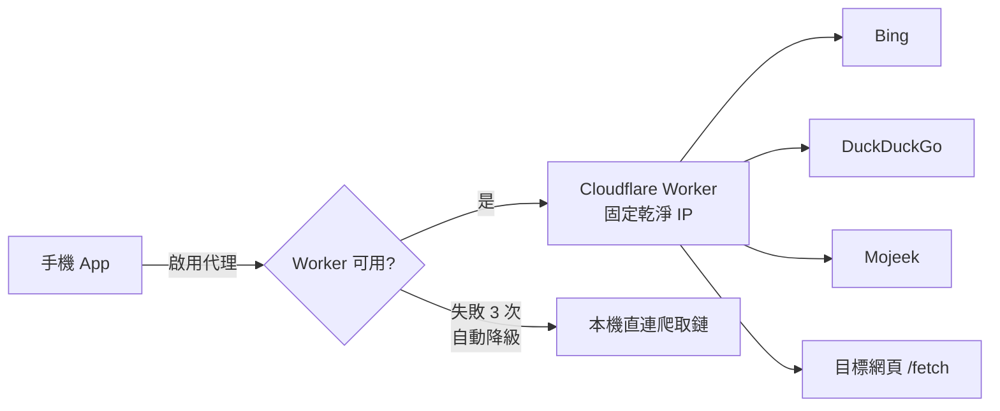

# nvidiapatch-search-proxy

部署在 Cloudflare Workers 上的「搜尋代理 + 網頁正文萃取」服務。手機 App（NvidiaPatch）的「搜尋代理」功能可將網路搜尋與抓頁請求轉發至此 Worker，避開電信 CGNAT 浮動 IP 與 TLS 指紋被搜尋引擎阻擋的問題，提升即時搜尋成功率。

## 功能與端點

| 端點 | 功能 |
|---|---|
| `GET /health` | 健康檢查，回傳 `{ "status": "ok", "version": "1.0.0" }`。App 的「測試 Worker 連線」按鈕即呼叫此端點。 |
| `GET /search?q=...&lang=zh-TW&max=8` | 代為搜尋：依序嘗試 Bing → DuckDuckGo → Mojeek，解析 HTML 結果頁，回傳標題、網址、摘要。 |
| `GET /fetch?url=...&maxChars=4500` | 代為抓取網頁：以 `HTMLRewriter` 串流萃取標題、meta 描述與正文文字，預設上限 4500 字。 |

### 內建防護機制

- **速率限制**：每 IP 每 60 秒最多 30 次請求，超過回 `429`。
- **快取**：搜尋結果快取 30 分鐘、抓頁結果快取 1 小時（Cloudflare Cache API）。
- **API 金鑰**：若有設定 `API_KEY` secret，所有端點（`/health` 除外）皆要求 `X-Api-Key` header 或 `?key=` 參數；未設定則完全開放。
- **SSRF 防護**：`/fetch` 拒絕 localhost、內網位址與非 HTTP(S) 協定。
- **Prompt injection 過濾**：抓回的正文會濾除「ignore all previous instructions」等注入字串。
- **CORS**：全開放（`Access-Control-Allow-Origin: *`），方便 App 直接呼叫。

## 部署步驟

Cloudflare Workers 免費方案即可使用（每日 10 萬次請求），此服務用量遠低於上限。

### 1. 事前準備

- 註冊 [Cloudflare 帳號](https://dash.cloudflare.com/sign-up)（免費）。
- 本機已安裝 Node.js（18 以上）。

### 2. 取得專案

將整個 `cloudflare-search-worker/` 資料夾複製到自己的機器。

### 3. 安裝依賴並登入 Cloudflare

```bash
cd cloudflare-search-worker
npm install
npx wrangler login
```

`wrangler login` 會開啟瀏覽器要求授權，同意後即完成登入。

### 4. 部署

```bash
npm run deploy
```

等同於 `wrangler deploy`。部署完成後終端機會印出 Worker 網址，格式為：

```
https://nvidiapatch-search-proxy.<你的子網域>.workers.dev
```

想改名的話，編輯 [`wrangler.toml`](wrangler.toml) 中的 `name` 欄位後重新部署即可。

### 5. （選填，建議）設定 API 金鑰

防止 Worker 網址外流後被他人盜用：

```bash
npx wrangler secret put API_KEY
```

輸入自訂金鑰字串。設定後，App 端「搜尋代理」分頁的「API 金鑰」欄位必須填入同一組值。

### 6. 驗證部署

瀏覽器開啟：

```
https://<你的-worker-網址>/health
```

看到以下回應即部署成功：

```json
{ "status": "ok", "version": "1.0.0" }
```

## App 端設定方式

1. 打開手機 App，點選右上角「設定 (Settings)」圖示。
2. 切換至「搜尋代理」分頁。
3. 填入您自己部署的 Worker 網址，例如：
   ```
   https://nvidiapatch-search-proxy.您的帳號.workers.dev
   ```
   注意：每個 Cloudflare 帳號的 Worker 網址皆不同，請填入自己部署後取得的網址。
4. 若部署時有設定 `API_KEY` secret，請在「API 金鑰」欄位填入同一組金鑰。
5. 點擊「測試 Worker 連線 (/health)」，確認顯示綠色勾選與成功訊息。
6. 開啟「啟用 Cloudflare 代理搜尋」開關，即可享受由 Worker 固定乾淨 IP 代為搜尋抓頁的高成功率服務。

若未來有任何網路不穩，系統均會全自動無感降級回本機直連（Bing → DuckDuckGo → Mojeek → Wikipedia），對話與資料檢索體驗不中斷。

## 架構示意



## 本機開發

```bash
npm run dev
```

以 wrangler dev 在本機 `http://localhost:8787` 啟動，方便修改 [`src/index.js`](src/index.js) 後即時測試。

## 專案結構

```
cloudflare-search-worker/
├── package.json      # 專案定義與 npm scripts
├── wrangler.toml     # Cloudflare Worker 設定（名稱、相容性、環境變數）
└── src/
    └── index.js      # Worker 主程式（所有端點與邏輯）
```
